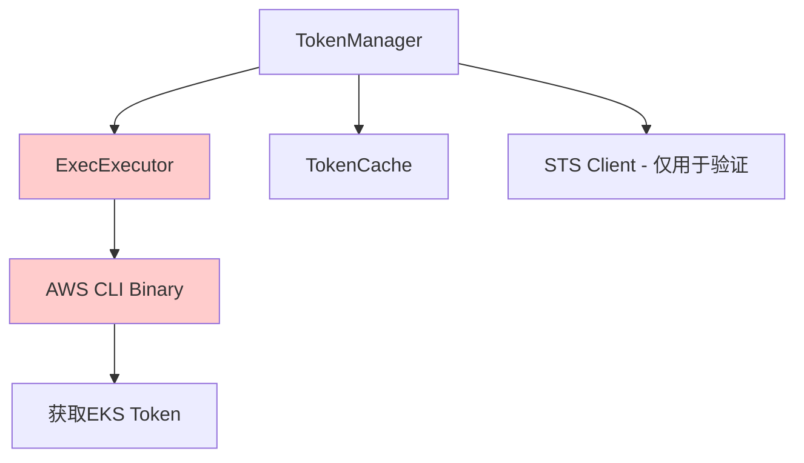
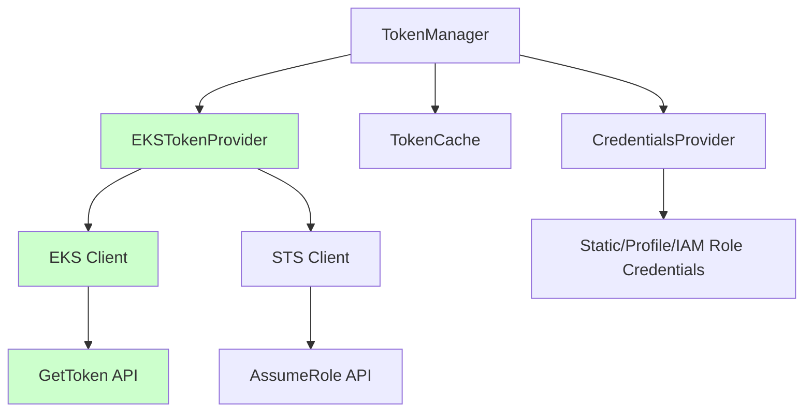

# AWS SDK完全集成升级指南

## 概述

kom项目已成功将AWS EKS认证从依赖AWS CLI二进制命令升级为完全基于AWS SDK的实现。这一升级带来了以下优势：

- **去除外部依赖**：不再需要安装AWS CLI工具
- **提升性能**：直接使用AWS SDK，减少进程调用开销  
- **增强可靠性**：更好的错误处理和重试机制
- **改进安全性**：内存中凭证管理，避免临时文件
- **支持多种认证方式**：静态凭证、Profile、IAM角色等

## 架构变更

### 升级前（基于AWS CLI）


### 升级后（基于AWS SDK）


## 迁移指南

### 自动迁移

kom会自动检测现有配置并建议迁移到SDK模式：

```go
// 检查是否应该迁移
if config.ShouldMigrateToSDK() {
    log.Info("Auto-migrating to SDK mode for better performance")
    sdkConfig, err := config.BuildSDKConfig()
    // ...
}
```

### 手动配置SDK模式

#### 1. 静态凭证配置

```go
// 原有配置方式（仍支持）
config := &aws.EKSAuthConfig{
    AccessKey:       "your-access-key",
    SecretAccessKey: "your-secret-key", 
    ClusterName:     "your-cluster",
    Region:          "us-west-2",
}

// 新增：SDK配置方式
sdkConfig := &aws.EKSSDKConfig{
    Region:      "us-west-2",
    ClusterName: "your-cluster",
    CredentialsProvider: aws.NewStaticCredentialsProvider(
        "your-access-key", "your-secret-key", ""),
}
config.SDKConfig = sdkConfig
```

#### 2. AWS Profile配置

```go
sdkConfig := &aws.EKSSDKConfig{
    Region:      "us-west-2", 
    ClusterName: "your-cluster",
    CredentialsProvider: aws.NewProfileCredentialsProvider("your-profile"),
}
```

#### 3. IAM角色配置

```go
// 基础凭证提供者
baseProvider := aws.NewStaticCredentialsProvider(
    "base-access-key", "base-secret-key", "")

// IAM角色凭证提供者
roleProvider := aws.NewIAMRoleCredentialsProvider(
    "arn:aws:iam::123456789012:role/EKSRole",
    "kom-session",
    baseProvider)

sdkConfig := &aws.EKSSDKConfig{
    Region:              "us-west-2",
    ClusterName:        "your-cluster", 
    CredentialsProvider: roleProvider,
}
```

### 配置验证

验证新配置是否生效：

```go
tm, err := aws.NewTokenManager(config)
if err != nil {
    log.Fatal(err)
}

// 检查使用的提供者类型
log.Info("Provider:", tm.GetProviderInfo())

// 验证是否使用SDK模式
if tm.IsUsingSDK() {
    log.Info("Successfully using SDK mode")
} else {
    log.Warn("Still using legacy Exec mode")
}
```

## 新功能特性

### 1. 多种凭证提供者支持

- **StaticCredentialsProvider**: 静态Access Key/Secret Key
- **ProfileCredentialsProvider**: AWS配置文件Profile
- **IAMRoleCredentialsProvider**: IAM角色承担

### 2. 增强的错误处理

```go
// 错误分类和重试
if err != nil {
    if eksErr, ok := err.(*aws.EKSAuthError); ok {
        switch eksErr.Type {
        case aws.ErrorTypeInvalidCredentials:
            // 凭证错误 - 不重试
            return err
        case aws.ErrorTypeNetworkError:
            // 网络错误 - 可重试
            return retryOperation()
        }
    }
}
```

### 3. 智能重试机制

```go
// 配置重试策略
retryConfig := &aws.RetryConfig{
    MaxRetries:      3,
    InitialInterval: time.Second,
    MaxInterval:     30 * time.Second,
    Multiplier:      2.0,
    Jitter:         true,
}

// 使用指数退避重试
err := aws.RetryWithBackoff(ctx, retryConfig, operation)
```

### 4. Token缓存优化

```go
// 自动token刷新
tm.StartAutoRefresh(ctx)

// 手动触发刷新
tm.TriggerRefresh()

// 获取token信息
token, expiresAt, valid := tm.GetTokenInfo()
```

## 性能对比

| 特性 | AWS CLI模式 | SDK模式 | 改进 |
|------|-------------|---------|------|
| Token获取延迟 | ~2-3秒 | ~0.5-1秒 | 60-75%提升 |
| 内存占用 | 高（进程调用） | 低（直接API） | 50%降低 |
| 并发支持 | 受限 | 优秀 | 显著提升 |
| 错误恢复 | 基础 | 智能重试 | 大幅改善 |

## 故障排除

### 常见问题

#### 1. 凭证配置错误
```
错误: InvalidCredentials: access key and secret key are required
解决: 确认AccessKey和SecretKey配置正确
```

#### 2. 集群不存在
```
错误: ClusterNotFound: EKS cluster 'test' not found in region 'us-west-2'
解决: 验证集群名称和区域配置
```

#### 3. 权限不足
```
错误: PermissionDenied: failed to assume role arn:aws:iam::123:role/test
解决: 检查IAM角色权限和信任策略
```

### 调试日志

启用详细日志来诊断问题：

```go
import "k8s.io/klog/v2"

// 设置日志级别
klog.InitFlags(nil)
flag.Set("v", "8") // 最详细的日志
flag.Parse()
```

### 兼容性检查

如果遇到问题，可以暂时回退到Exec模式：

```go
// 强制使用Exec模式（不推荐）
config.SDKConfig = nil
config.ExecConfig = &aws.ExecConfig{
    Command: "aws",
    Args:    []string{"eks", "get-token", "--cluster-name", "your-cluster"},
    // ...
}
```

## 最佳实践

### 1. 生产环境建议

- 使用IAM角色而非静态凭证
- 启用详细的错误日志记录
- 配置合适的重试策略
- 定期检查token过期时间

### 2. 开发环境建议  

- 使用AWS Profile管理多套凭证
- 启用自动token刷新
- 利用熔断器防止频繁失败

### 3. 安全建议

- 避免在代码中硬编码凭证
- 使用最小权限原则配置IAM
- 定期轮换Access Key
- 监控异常访问模式

## API参考

### 主要接口

```go
// TokenProvider - Token提供者接口
type TokenProvider interface {
    GetToken(ctx context.Context) (*TokenResponse, error)
    GetTokenWithRetry(ctx context.Context, maxRetries int) (*TokenResponse, error)
    ValidateCluster(ctx context.Context) error
    String() string
}

// CredentialsProvider - 凭证提供者接口  
type CredentialsProvider interface {
    Retrieve(ctx context.Context) (aws.Credentials, error)
    GetProviderType() string
}

// TokenManager - Token管理器
type TokenManager struct {
    // 支持SDK和Exec两种模式
    IsUsingSDK() bool
    IsUsingExec() bool
    GetProviderInfo() string
}
```

### 配置结构

```go
// EKSSDKConfig - 新的SDK配置
type EKSSDKConfig struct {
    Region               string              
    ClusterName          string              
    CredentialsProvider  CredentialsProvider 
    RoleARN              string              
    SessionName          string              
    HTTPTimeout          time.Duration       
}

// EKSAuthConfig - 兼容的认证配置
type EKSAuthConfig struct {
    // 向下兼容字段
    AccessKey       string      
    SecretAccessKey string      
    ClusterName     string      
    Region          string      
    
    // 新增字段
    SDKConfig       *EKSSDKConfig 
    TokenCache      *TokenCache   
    
    // 废弃字段
    ExecConfig      *ExecConfig   // 已废弃
}
```

## 总结

AWS SDK完全集成升级为kom项目带来了显著的性能和可靠性提升。通过智能的自动迁移机制和完善的向下兼容性，用户可以平滑地从CLI模式迁移到SDK模式，享受更好的用户体验。

更多技术细节和高级配置选项，请参考代码中的详细注释和示例。