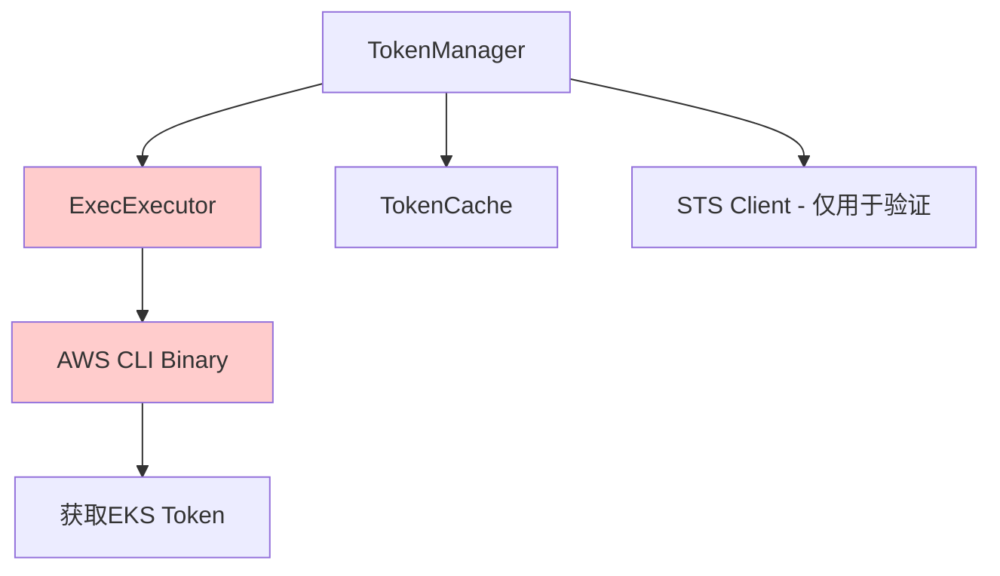
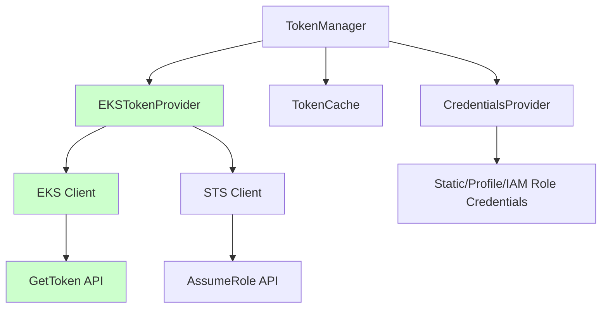
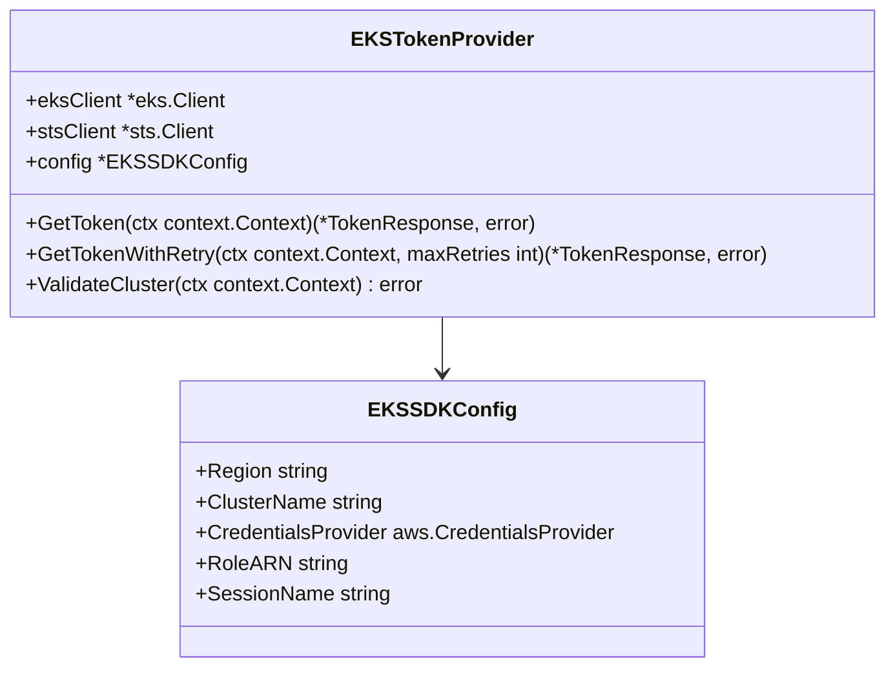
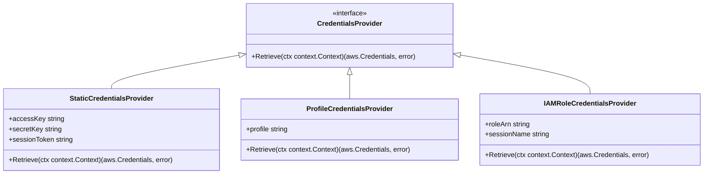
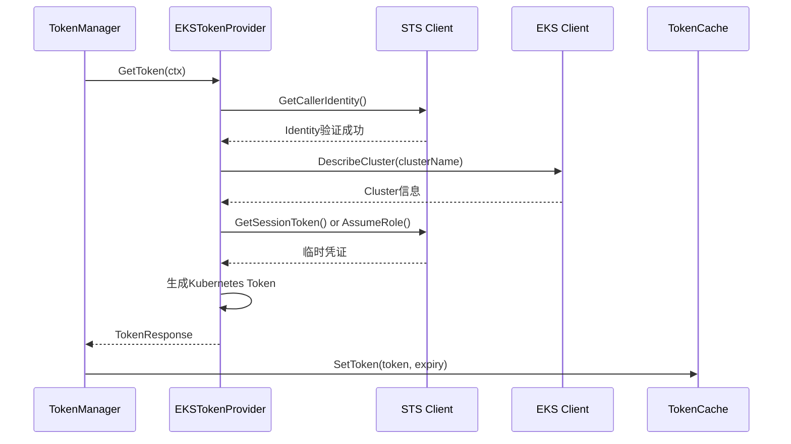
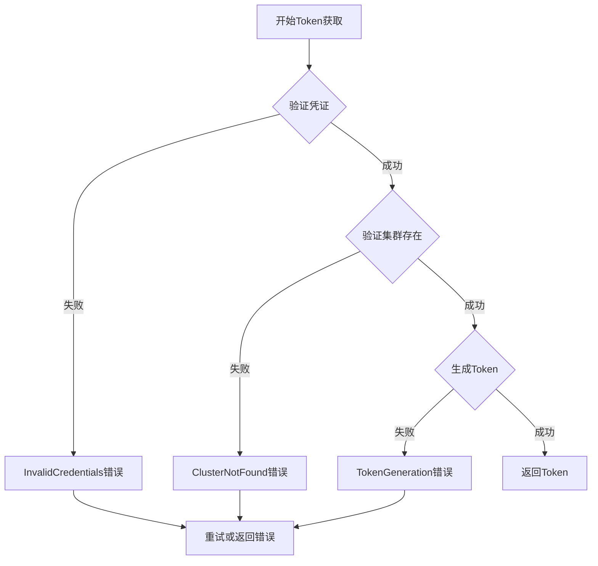
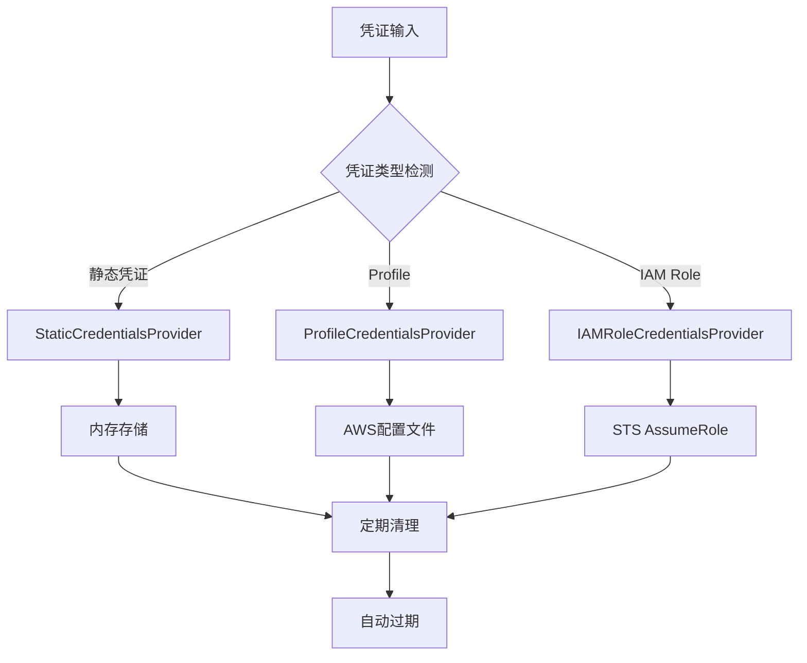
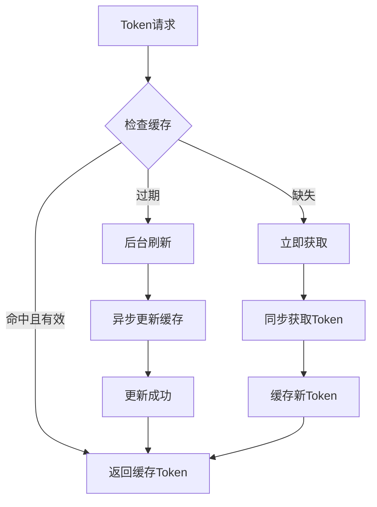

# AWS SDK完全集成设计

## 概述

当前kom项目在AWS EKS集群认证过程中依赖执行二进制AWS CLI命令来获取token，这种方式存在以下问题：
- 依赖外部二进制工具，增加部署复杂性
- 无法控制命令执行的安全性和稳定性
- 缺乏细粒度的错误处理和日志记录
- 在容器化环境中需要额外安装AWS CLI

本设计旨在将当前基于AWS CLI命令的认证机制完全升级为纯AWS SDK实现，实现彻底去除对AWS二进制命令的依赖。

## 技术架构

### 当前架构分析



当前实现的主要问题：
- `ExecExecutor` 执行外部AWS CLI命令
- 依赖系统安装的AWS CLI工具
- Token获取完全通过命令行完成

### 目标架构设计



### 核心组件重新设计

#### EKSTokenProvider - EKS Token提供者
替代当前的`ExecExecutor`，直接使用AWS SDK获取EKS token：



#### CredentialsProvider - 凭证提供者
支持多种AWS凭证获取方式：



## API接口设计

### EKS Token获取接口

使用AWS SDK的`eks.DescribeCluster`和STS服务生成符合Kubernetes要求的token：

```go
type EKSTokenProvider interface {
    // GetToken 获取EKS认证token
    GetToken(ctx context.Context) (*TokenResponse, error)
    
    // GetTokenWithRetry 带重试机制获取token  
    GetTokenWithRetry(ctx context.Context, maxRetries int) (*TokenResponse, error)
    
    // ValidateCluster 验证EKS集群是否存在
    ValidateCluster(ctx context.Context) error
}

type EKSSDKConfig struct {
    Region               string                     // AWS区域
    ClusterName          string                     // EKS集群名称
    CredentialsProvider  aws.CredentialsProvider    // 凭证提供者
    RoleARN              string                     // IAM角色ARN（可选）
    SessionName          string                     // 会话名称（可选）
}
```

### 凭证管理接口

```go
type CredentialsProvider interface {
    // Retrieve 获取AWS凭证
    Retrieve(ctx context.Context) (aws.Credentials, error)
}

// 静态凭证提供者
type StaticCredentialsProvider struct {
    AccessKey    string
    SecretKey    string
    SessionToken string
}

// Profile凭证提供者
type ProfileCredentialsProvider struct {
    Profile string
}

// IAM角色凭证提供者
type IAMRoleCredentialsProvider struct {
    RoleARN     string
    SessionName string
    BaseProvider aws.CredentialsProvider
}
```

## 数据流设计

### Token获取流程



### 错误处理流程



## 实现细节

### EKS Token生成算法

基于AWS STS生成符合Kubernetes要求的Bearer Token：

```go
func (etp *EKSTokenProvider) generateKubernetesToken(ctx context.Context) (*TokenResponse, error) {
    // 1. 构建预签名URL
    presignClient := sts.NewPresignClient(etp.stsClient)
    
    request := &sts.GetCallerIdentityInput{}
    presignedRequest, err := presignClient.PresignGetCallerIdentity(ctx, request, func(opts *sts.PresignOptions) {
        opts.Expires = 15 * time.Minute
    })
    
    // 2. 构建token
    tokenURL := presignedRequest.URL
    clusterName := etp.config.ClusterName
    
    // 3. 按照Kubernetes exec认证规范生成token
    token := fmt.Sprintf("k8s-aws-v1.%s", base64.RawURLEncoding.EncodeToString([]byte(tokenURL)))
    
    return &TokenResponse{
        Token:     token,
        ExpiresAt: time.Now().Add(14 * time.Minute), // 比预签名URL早1分钟过期
    }, nil
}
```

### 凭证提供者实现

```go
// 静态凭证提供者
func (scp *StaticCredentialsProvider) Retrieve(ctx context.Context) (aws.Credentials, error) {
    return aws.Credentials{
        AccessKeyID:     scp.AccessKey,
        SecretAccessKey: scp.SecretKey,
        SessionToken:    scp.SessionToken,
    }, nil
}

// IAM角色凭证提供者
func (ircp *IAMRoleCredentialsProvider) Retrieve(ctx context.Context) (aws.Credentials, error) {
    stsClient := sts.NewFromConfig(aws.Config{
        Credentials: ircp.BaseProvider,
    })
    
    result, err := stsClient.AssumeRole(ctx, &sts.AssumeRoleInput{
        RoleArn:         aws.String(ircp.RoleARN),
        RoleSessionName: aws.String(ircp.SessionName),
    })
    
    if err != nil {
        return aws.Credentials{}, err
    }
    
    return aws.Credentials{
        AccessKeyID:     *result.Credentials.AccessKeyId,
        SecretAccessKey: *result.Credentials.SecretAccessKey,
        SessionToken:    *result.Credentials.SessionToken,
    }, nil
}
```

## 配置变更

### 新增配置结构

```go
// EKSSDKConfig 替代原有的ExecConfig
type EKSSDKConfig struct {
    Region               string                     `json:"region"`
    ClusterName          string                     `json:"cluster_name"`
    CredentialsProvider  aws.CredentialsProvider    `json:"-"` // 不序列化
    RoleARN              string                     `json:"role_arn,omitempty"`
    SessionName          string                     `json:"session_name,omitempty"`
}

// EKSAuthConfig 更新
type EKSAuthConfig struct {
    // 保持向下兼容的字段
    AccessKey       string `json:"access_key"`
    SecretAccessKey string `json:"secret_access_key"`
    ClusterName     string `json:"cluster_name"`
    Region          string `json:"region"`
    RoleARN         string `json:"role_arn,omitempty"`
    SessionName     string `json:"session_name,omitempty"`
    
    // 新增字段
    SDKConfig       *EKSSDKConfig `json:"sdk_config,omitempty"`
    TokenCache      *TokenCache   `json:"token_cache"`
    AWSConfig       *aws.Config   `json:"-"`
    
    // 废弃字段（保持兼容性）
    ExecConfig      *ExecConfig   `json:"exec_config,omitempty"` // 标记为deprecated
}
```

### 迁移策略

支持平滑迁移，同时兼容新旧配置：

```go
func (tm *TokenManager) initTokenProvider() error {
    // 优先使用新的SDK配置
    if tm.eksConfig.SDKConfig != nil {
        tm.tokenProvider = NewEKSTokenProvider(tm.eksConfig.SDKConfig)
        return nil
    }
    
    // 回退到旧的Exec配置（向下兼容）
    if tm.eksConfig.ExecConfig != nil {
        klog.Warning("Using deprecated exec-based token provider, consider migrating to SDK")
        tm.tokenProvider = NewExecTokenProvider(tm.eksConfig.ExecConfig)
        return nil
    }
    
    // 从基本配置自动生成SDK配置
    sdkConfig := &EKSSDKConfig{
        Region:      tm.eksConfig.Region,
        ClusterName: tm.eksConfig.ClusterName,
        RoleARN:     tm.eksConfig.RoleARN,
        SessionName: tm.eksConfig.SessionName,
    }
    
    // 创建静态凭证提供者
    if tm.eksConfig.AccessKey != "" && tm.eksConfig.SecretAccessKey != "" {
        sdkConfig.CredentialsProvider = &StaticCredentialsProvider{
            AccessKey: tm.eksConfig.AccessKey,
            SecretKey: tm.eksConfig.SecretAccessKey,
        }
    }
    
    tm.tokenProvider = NewEKSTokenProvider(sdkConfig)
    return nil
}
```

## 安全性增强

### 凭证安全管理



### 权限最小化原则

建议的IAM权限配置：

```json
{
    "Version": "2012-10-17",
    "Statement": [
        {
            "Effect": "Allow",
            "Action": [
                "eks:DescribeCluster",
                "sts:GetCallerIdentity"
            ],
            "Resource": "*"
        },
        {
            "Effect": "Allow",
            "Action": [
                "sts:AssumeRole"
            ],
            "Resource": "arn:aws:iam::*:role/EKSClusterAccessRole*"
        }
    ]
}
```

## 性能优化

### Token缓存策略



### 连接池优化

```go
type EKSTokenProvider struct {
    eksClient    *eks.Client
    stsClient    *sts.Client
    config       *EKSSDKConfig
    
    // 连接复用
    httpClient   *http.Client
    
    // 并发控制
    rateLimiter  *rate.Limiter
    concurrency  chan struct{}
}

func NewEKSTokenProvider(config *EKSSDKConfig) *EKSTokenProvider {
    // 配置HTTP客户端连接池
    httpClient := &http.Client{
        Transport: &http.Transport{
            MaxIdleConns:       10,
            MaxIdleConnsPerHost: 2,
            IdleConnTimeout:    30 * time.Second,
        },
        Timeout: 30 * time.Second,
    }
    
    // 配置AWS客户端
    awsConfig := aws.Config{
        Region:     config.Region,
        HTTPClient: httpClient,
        Credentials: config.CredentialsProvider,
    }
    
    return &EKSTokenProvider{
        eksClient:   eks.NewFromConfig(awsConfig),
        stsClient:   sts.NewFromConfig(awsConfig),
        config:      config,
        rateLimiter: rate.NewLimiter(rate.Limit(10), 20), // 10 TPS, burst 20
        concurrency: make(chan struct{}, 5), // 最大5个并发请求
    }
}
```

## 错误处理与重试

### 分层错误处理

```go
// 错误类型定义
const (
    ErrorTypeCredentialsInvalid = "CredentialsInvalid"
    ErrorTypeClusterNotFound    = "ClusterNotFound"
    ErrorTypeTokenGeneration    = "TokenGeneration"
    ErrorTypeNetworkTimeout     = "NetworkTimeout"
    ErrorTypeRateLimited        = "RateLimited"
)

// 重试策略
func (etp *EKSTokenProvider) GetTokenWithRetry(ctx context.Context, maxRetries int) (*TokenResponse, error) {
    backoff := &exponentialBackoff{
        InitialInterval: time.Second,
        MaxInterval:     30 * time.Second,
        Multiplier:      2.0,
        MaxRetries:      maxRetries,
    }
    
    for attempt := 0; attempt <= maxRetries; attempt++ {
        token, err := etp.GetToken(ctx)
        if err == nil {
            return token, nil
        }
        
        // 判断是否应该重试
        if !shouldRetry(err) {
            return nil, err
        }
        
        if attempt < maxRetries {
            waitTime := backoff.NextBackoff()
            time.Sleep(waitTime)
        }
    }
    
    return nil, fmt.Errorf("failed to get token after %d retries", maxRetries)
}

func shouldRetry(err error) bool {
    if eksErr, ok := err.(*EKSAuthError); ok {
        switch eksErr.Type {
        case ErrorTypeNetworkTimeout, ErrorTypeRateLimited:
            return true
        case ErrorTypeCredentialsInvalid, ErrorTypeClusterNotFound:
            return false
        default:
            return true
        }
    }
    return true
}
```

## 测试策略

### 单元测试覆盖

```go
func TestEKSTokenProvider_GetToken(t *testing.T) {
    tests := []struct {
        name           string
        config         *EKSSDKConfig
        mockSTS        func(*sts.Client)
        mockEKS        func(*eks.Client)
        expectedError  string
        expectedToken  bool
    }{
        {
            name: "successful token generation",
            config: &EKSSDKConfig{
                Region:      "us-west-2",
                ClusterName: "test-cluster",
                CredentialsProvider: &StaticCredentialsProvider{
                    AccessKey: "test-key",
                    SecretKey: "test-secret",
                },
            },
            expectedToken: true,
        },
        {
            name: "invalid credentials",
            config: &EKSSDKConfig{
                Region:      "us-west-2",
                ClusterName: "test-cluster",
                CredentialsProvider: &StaticCredentialsProvider{
                    AccessKey: "invalid-key",
                    SecretKey: "invalid-secret",
                },
            },
            expectedError: "CredentialsInvalid",
        },
    }
    
    for _, tt := range tests {
        t.Run(tt.name, func(t *testing.T) {
            provider := NewEKSTokenProvider(tt.config)
            token, err := provider.GetToken(context.Background())
            
            if tt.expectedError != "" {
                assert.Error(t, err)
                assert.Contains(t, err.Error(), tt.expectedError)
            } else {
                assert.NoError(t, err)
                if tt.expectedToken {
                    assert.NotEmpty(t, token.Token)
                    assert.True(t, token.ExpiresAt.After(time.Now()))
                }
            }
        })
    }
}
```

### 集成测试

```go
func TestEKSIntegration(t *testing.T) {
    if testing.Short() {
        t.Skip("Skipping integration test")
    }
    
    config := &EKSSDKConfig{
        Region:      os.Getenv("AWS_REGION"),
        ClusterName: os.Getenv("EKS_CLUSTER_NAME"),
        CredentialsProvider: &StaticCredentialsProvider{
            AccessKey: os.Getenv("AWS_ACCESS_KEY_ID"),
            SecretKey: os.Getenv("AWS_SECRET_ACCESS_KEY"),
        },
    }
    
    provider := NewEKSTokenProvider(config)
    
    // 测试Token获取
    token, err := provider.GetToken(context.Background())
    assert.NoError(t, err)
    assert.NotEmpty(t, token.Token)
    
    // 测试集群验证
    err = provider.ValidateCluster(context.Background())
    assert.NoError(t, err)
}
```